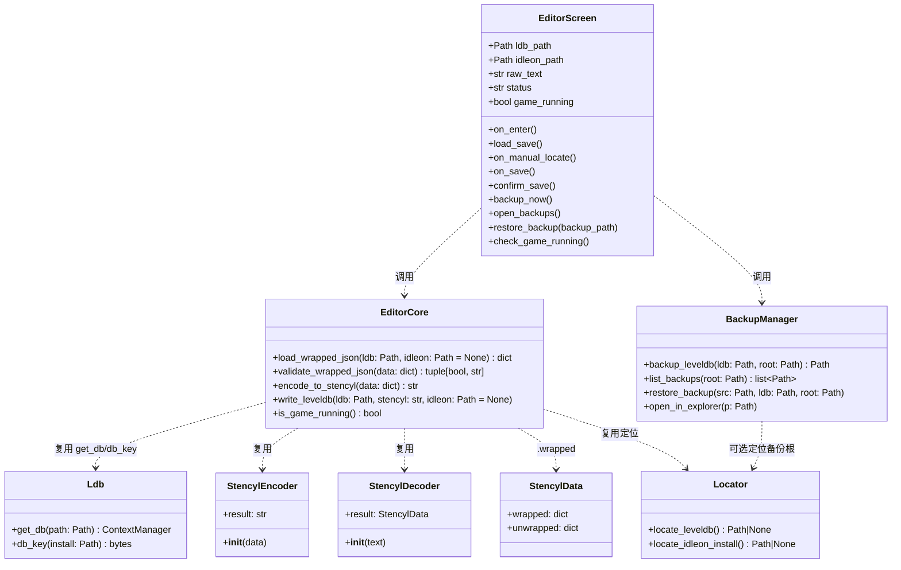
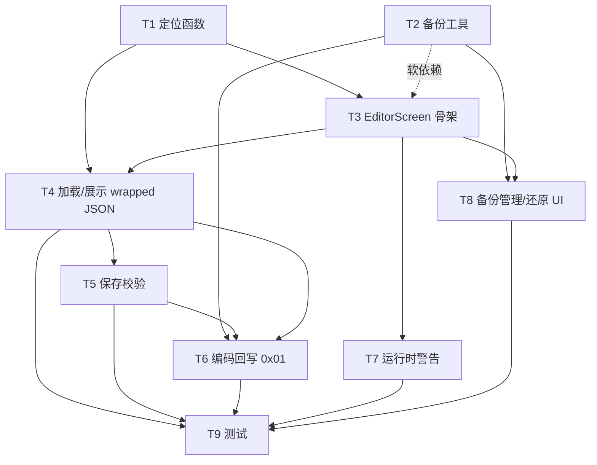

# idleon-saver「存档编辑器」— 系统架构设计 + 任务分解

> 架构师：高见远（Bob）｜语言：中文｜技术栈：Python 3.9 + kivy 2.1 + plyvel（维持不变）
> 依据：`docs/prd-editor.md` + `idleon_saver/` 代码探查事实

---

## 0. 文档信息

| 项 | 内容 |
|---|---|
| 设计对象 | `idleon_saver` GUI 新增 `EditorScreen`，编辑 LevelDB 存档的 wrapped JSON 并无损回写 |
| 复用核心 | `ldb.py`(`get_db`/`db_key`)、`stencyl/decoder.py`(`StencylDecoder`)、`stencyl/encoder.py`(`StencylEncoder`)、`decode.py`/`encode.py` 的调用范式 |
| 不改动 | `stencyl/`（编解码核心）、`scripts/`（CLI 链路）、现有向导 `StartScreen/PathScreen/EndScreen` 业务逻辑 |
| 交付 | 本文件（架构 + 任务分解），无源码改动 |

---

## 1. 实现方案 + 框架选型

### 1.1 复用清单（不重造轮子）

| 现有模块/符号 | 用途 | 调用方式 |
|---|---|---|
| `idleon_saver.ldb.get_db(path)` | 以 contextmanager 打开 LevelDB 目录（`pathlib.Path`） | `with get_db(ldb) as db:` |
| `idleon_saver.ldb.db_key(install_path)` | 构造存档 key（`_file://\x00\x01/...index.html:mySave`），参数为**游戏安装目录** | `key = db_key(install)` |
| `idleon_saver.stencyl.decoder.StencylDecoder(text).result` | 把 Stencyl 字符串解码为 `StencylData` | 返回对象 |
| `idleon_saver.stencyl.encoder.StencylEncoder(data).result` | 把 **wrapped JSON** 重新编码为 Stencyl 字符串；**只接受 wrapped JSON**（`x["start"]`/`x["contents"]`/`x["end"]`） | 返回字符串 |
| `StencylData.wrapped` (属性) | 取回可编辑的 `{"start","contents","end"}` 字典 | 加载进编辑区 |
| `idleon_saver.utility.user_dir()` | 工具自身工作目录 `%APPDATA%/IdleonSaver` | 备份/状态落盘基准 |
| `MyScreen` / `Popup` / `TextInput` / `BoxLayout` | 现有 GUI 控件范式 | 直接继承/复用 |

> **关键约束落地**：`StencylEncoder._encode` 直接做 `x["start"]` 下标访问，普通值会 `TypeError` → 编辑器**只编辑 wrapped JSON**，禁止编辑 unwrapped。

### 1.2 新增模块

| 文件 | 角色 | 说明 |
|---|---|---|
| `idleon_saver/utility.py`（**修改**） | 定位函数 | 新增 `locate_leveldb()`、`locate_idleon_install()` |
| `idleon_saver/backup.py`（**新增**） | 备份工具（无状态函数） | 备份/列出/还原/打开目录 |
| `idleon_saver/editor.py`（**新增**） | 编辑器业务逻辑（**纯逻辑、不依赖 kivy**） | 加载、校验、编码、回写、进程检测 |
| `idleon_saver/gui/editor.py`（**新增**） | `EditorScreen` 及对话框 | 仅做 UI 编排，调用 `editor.py` |
| `idleon_saver/gui/main.py`（**修改**） | 注册 `EditorScreen` + 入口 | 不改动现有向导逻辑 |
| `idleon_saver/gui/main.kv`（**修改**） | 增加 `<EditorScreen>` 规则 | 复用现有配色/控件风格 |
| `tests/test_editor.py`（**新增**） | 纯逻辑单测 | 覆盖 `editor.py` / `backup.py` |

### 1.3 架构模式（分层 + 工具函数）

```
┌──────────────────────────────────────────────┐
│ UI 层   EditorScreen (gui/editor.py) + main.kv │  ← 仅编排、状态、弹窗
├──────────────────────────────────────────────┤
│ 业务层  editor.py（纯逻辑，可单测，无 kivy）    │  load / validate / encode / write / is_game_running
├──────────────────────────────────────────────┤
│ 工具层  backup.py / utility.locate_*           │  备份、定位（无状态函数）
├──────────────────────────────────────────────┤
│ 编解码层（禁止改动）                            │  ldb.py / stencyl/* / decoder / encoder
└──────────────────────────────────────────────┘
```

- **UI ↔ 逻辑解耦**：`EditorScreen` 不直接碰 `plyvel`/`StencylEncoder`，全部经 `editor.py`。好处：可单测、可复用、可后续接 CLI。
- **最小改动原则**：编解码核心（`stencyl/`、`scripts/`）完全不动；CLI 链路（`decode`/`encode`）仅作参考，不在 GUI 内走 argparse。

### 1.4 四项关键技术决策

1. **加载走内存、不落盘中间文件**：
   直接 `get_db(ldb).get(db_key(install))` → `bytes.strip(b"\x01")` → `StencylDecoder(text).result.wrapped`。
   若未提供安装目录，则扫描 db 中后缀为 `b"index.html:mySave"` 的 key（保证往返 key 一致，**免去对安装目录的猜测依赖**）。
2. **回写带 `0x01` 前缀**：
   `StencylEncoder(data).result` → `db.put(key, b"\x01" + stencyl_str.encode("ascii"))`，与 `encode.py:stencyl2ldb` 完全一致。
3. **进程检测零新依赖**：
   用标准库 `subprocess` 调 `tasklist`（win32）/ `pgrep`（posix）匹配 `LegendsOfIdleon.exe`，**不引入 psutil**。
4. **入口设计为「独立侧屏」**：
   `EditorScreen` 注册进 `MainWindow` 但不插入 `start→find_exe→end` 线性链（`next()`/`previous()` 不受影响）；由 `EndScreen` 按钮（REQ-14，P2）或 `StartScreen` 的「编辑存档」按钮通过 `manager.current = "editor"` 跳转，关闭后 `manager.current` 回到来源屏。

---

## 2. 文件列表（相对路径 + 新增/修改说明）

| 路径 | 类型 | 说明 |
|---|---|---|
| `idleon_saver/utility.py` | 修改 | 新增 `locate_leveldb() -> Path\|None`、`locate_idleon_install() -> Path\|None`；其余不动 |
| `idleon_saver/backup.py` | 新增 | 备份模块：`backup_leveldb` / `list_backups` / `restore_backup` / `open_in_explorer` |
| `idleon_saver/editor.py` | 新增 | 编辑器纯逻辑：`load_wrapped_json` / `validate_wrapped_json` / `encode_to_stencyl` / `write_leveldb` / `is_game_running` |
| `idleon_saver/gui/editor.py` | 新增 | `EditorScreen(MyScreen)` + `BackupDialog` + `ConfirmDialog`；绑定按钮与状态 |
| `idleon_saver/gui/main.py` | 修改 | `MainWindow.__init__` 增加 `EditorScreen(name="editor")`；在 `EndScreen`/`StartScreen` 增加入口回调 |
| `idleon_saver/gui/main.kv` | 修改 | 增加 `<EditorScreen>` 布局规则（标题栏/警告横幅/状态行/TextInput/按钮行）；复用现有 `coolgray*` 配色与 `Header`/`Infobox`/`ButtonBox` |
| `tests/test_editor.py` | 新增 | 单测 `editor.py` 与 `backup.py` 纯逻辑（无需启动 GUI） |
| `docs/design-editor.md` | 新增 | 本设计文档 |

> 不改 `stencyl/`、`scripts/`、`cli.py`、现有三个 Screen 的业务逻辑。

---

## 3. 数据结构与接口（类图 + 表格）

### 3.1 Mermaid 类图



### 3.2 接口签名表

**`idleon_saver/editor.py`（新增，纯逻辑）**

| 函数 | 签名 | 说明 |
|---|---|---|
| 加载 | `load_wrapped_json(ldb: Path, idleon: Path \| None = None) -> dict` | 读 key→strip `0x01`→`StencylDecoder`→`.wrapped`；`idleon=None` 时扫描 `mySave` key |
| 校验 | `validate_wrapped_json(data) -> tuple[bool, str]` | 结构预检 + `StencylEncoder(data).result` 试编码，返回 `(ok, 错误描述)` |
| 编码 | `encode_to_stencyl(data: dict) -> str` | 包装 `StencylEncoder(data).result` |
| 回写 | `write_leveldb(ldb: Path, stencyl: str, idleon: Path \| None = None)` | `db.put(key, b"\x01" + stencyl.encode("ascii"))` |
| 进程 | `is_game_running() -> bool` | `subprocess` 检测 `LegendsOfIdleon.exe` |

**`idleon_saver/backup.py`（新增，无状态）**

| 函数 | 签名 | 说明 |
|---|---|---|
| 备份 | `backup_leveldb(ldb: Path, root: Path) -> Path` | `shutil.copytree` 到 `root/leveldb_{timestamp}`，返回路径 |
| 列出 | `list_backups(root: Path) -> list[Path]` | 按修改时间倒序返回备份目录 |
| 还原 | `restore_backup(src: Path, ldb: Path, root: Path)` | 先 `backup_leveldb` 当前态，再 `copytree` 覆盖回 `ldb` |
| 打开 | `open_in_explorer(p: Path)` | `os.startfile(p, "explore")` 在资源管理器定位 |

**`idleon_saver/utility.py`（修改，新增）**

| 函数 | 签名 | 说明 |
|---|---|---|
| 定位存档 | `locate_leveldb() -> Path \| None` | 探测 `%APPDATA%/legends-of-idleon/Local Storage/leveldb` |
| 定位安装 | `locate_idleon_install() -> Path \| None` | 默认 `C:/Program Files (x86)/Steam/steamapps/common/Legends of Idleon`，存在则返回，否则 `None` |

**`idleon_saver/gui/editor.py`（新增）**

| 成员 | 类型 | 说明 |
|---|---|---|
| `EditorScreen.ldb_path` / `idleon_path` | `Path` Property | 当前存档目录与（可选）安装目录 |
| `EditorScreen.raw_text` | `StringProperty` | 绑定到 `TextInput.text`（wrapped JSON 文本） |
| `EditorScreen.status` | `StringProperty` | 「空闲/加载中/保存中/已保存」 |
| `EditorScreen.game_running` | `BooleanProperty` | 控制警告横幅显隐 |
| `on_enter()` | method | 进入屏时自动定位→加载→检测进程 |
| `load_save()` / `on_manual_locate()` | method | 加载 / 手动选目录（`FileChooserDialog` 复用） |
| `on_save()` → `confirm_save()` | method | 校验→二次确认弹窗→编码回写（回写前强制备份） |
| `backup_now()` / `open_backups()` / `restore_backup(p)` | method | 备份管理 UI 接线 |

---

## 4. 程序调用流程（时序图）

用户从入口 → 自动定位 → 备份 → 加载 wrapped JSON → 编辑 → 校验 → 编码回写 的完整时序：

```mermaid
sequenceDiagram
    autonumber
    actor U as 用户
    participant ES as EditorScreen
    participant EC as editor.py
    participant LOC as utility.locate_*
    participant BK as backup.py
    participant LDB as ldb.py
    participant DEC as StencylDecoder
    participant ENC as StencylEncoder

    U->>ES: 点击「编辑存档」(来自 EndScreen/StartScreen)
    ES->>ES: on_enter()
    ES->>LOC: locate_leveldb()
    LOC-->>ES: ldb_path | None
    alt 定位失败
        ES->>U: 弹出 FileChooserDialog 手动指定
        U-->>ES: 选择目录
    end
    ES->>EC: is_game_running()
    EC-->>ES: game_running(bool)
    ES->>ES: 显示/隐藏警告横幅

    ES->>BK: backup_leveldb(ldb, root)
    BK->>LDB: get_db(ldb); copytree
    BK-->>ES: backup_path

    ES->>EC: load_wrapped_json(ldb, idleon)
    EC->>LDB: get_db(ldb).get(key)
    LDB-->>EC: 原始字节(含 0x01)
    EC->>DEC: StencylDecoder(strip(0x01)).result
    DEC-->>EC: StencylData
    EC-->>ES: wrapped dict
    ES->>ES: raw_text = json.dumps(wrapped)

    U->>ES: 编辑 JSON 文本
    U->>ES: 点击「保存」
    ES->>EC: validate_wrapped_json(json.loads(raw_text))
    EC->>ENC: StencylEncoder(data).result (试编码)
    alt 校验失败
        EC-->>ES: (False, 错误)
        ES->>U: 报错并拦截保存
    else 校验通过
        EC-->>ES: (True, "")
        ES->>U: 弹出二次确认对话框
        U->>ES: 确认
        ES->>BK: backup_leveldb(ldb, root)  %% 写前强制备份
        BK-->>ES: backup_path
        ES->>EC: encode_to_stencyl(data)
        EC->>ENC: StencylEncoder(data).result
        ENC-->>EC: stencyl_str
        ES->>EC: write_leveldb(ldb, stencyl_str, idleon)
        EC->>LDB: db.put(key, b"\x01"+stencyl_str)
        ES->>ES: status = 已保存
    end
```

> 还原流程（P1 REQ-10）：`restore_backup(src, ldb, root)` 内部先 `backup_leveldb` 当前态，再 `copytree` 覆盖 `ldb`；复用同一 `get_db`/`copytree` 路径，不触碰编解码核心。

---

## 5. 任务列表（有序、含依赖、按实现顺序）

> 说明：本列表按 PRD/主理人要求的细粒度拆解为 T1–T9（团队通用「≤5 任务」默认规则在此按主理人显式要求放宽）。每项含 **目标 / 产出文件 / 依赖**。

| 编号 | 任务 | 目标 | 产出文件 | 依赖 | 优先级 |
|---|---|---|---|---|---|
| T1 | 存档定位函数 | 实现 `locate_leveldb()` / `locate_idleon_install()`，自动探测 `%APPDATA%\legends-of-idleon\Local Storage\leveldb` 与 Steam 安装目录 | `idleon_saver/utility.py` | 无 | P0 |
| T2 | 备份工具 | 实现 `backup_leveldb` / `list_backups` / `restore_backup` / `open_in_explorer`（命名含时间戳、写前强制备份、还原前再备份） | `idleon_saver/backup.py` | 无 | P0 |
| T3 | EditorScreen 骨架接入 | 新增 `EditorScreen`，注册进 `MainWindow`（独立侧屏），打通 `EndScreen`/`StartScreen` 入口与关闭返回；布局含标题栏/状态行/TextInput/按钮行（kv 规则） | `idleon_saver/gui/editor.py`、`idleon_saver/gui/main.py`、`idleon_saver/gui/main.kv` | T1（定位入口）、T2（备份入口，软依赖） | P0 |
| T4 | 加载并展示 wrapped JSON | 实现 `editor.load_wrapped_json`：经 `get_db`→`db_key`/扫描 key→strip `0x01`→`StencylDecoder`→`.wrapped`，载入 `TextInput`（等宽/可滚动，REQ-07） | `idleon_saver/editor.py`、`idleon_saver/gui/editor.py` | T1、T3 | P0 |
| T5 | 保存校验 | 实现 `editor.validate_wrapped_json`：JSON 合法 + 保留 `start/contents/end` 结构（递归校验容器节点含 `end`），非法则拦截并明确报错 | `idleon_saver/editor.py`、`idleon_saver/gui/editor.py` | T4 | P0 |
| T6 | 编码回写（带 0x01） | 实现 `editor.encode_to_stencyl` + `write_leveldb`：`StencylEncoder(data).result` → `db.put(key, b"\x01"+val)`；回写前调用 T2 强制备份 + 二次确认（REQ-08） | `idleon_saver/editor.py`、`idleon_saver/gui/editor.py` | T2、T5、T4 | P0 |
| T7 | 游戏运行时警告 | 实现 `editor.is_game_running()`（`subprocess` 检测 `LegendsOfIdleon.exe`，零新依赖）+ UI 警告横幅显隐 | `idleon_saver/editor.py`、`idleon_saver/gui/editor.py`、`idleon_saver/gui/main.kv` | T3 | P0 |
| T8 | 备份管理 / 还原 UI | 列表展示历史备份（按时间戳）、「打开备份目录」入口、`restore_backup` 一键还原接线（P1 REQ-09/REQ-10） | `idleon_saver/gui/editor.py`、`idleon_saver/editor.py`（无新增）、`idleon_saver/backup.py`（已建） | T2、T3 | P1 |
| T9 | 测试 | `tests/test_editor.py` 覆盖：定位（含失败回退）、加载往返、`validate_wrapped_json`（合法/非法/缺 end）、`encode_to_stencyl`、`write_leveldb` 前缀、`backup_leveldb`/`restore_backup`、进程检测 mock | `tests/test_editor.py` | T4、T5、T6、T7、T8 | P0（质量门禁） |

### 5.1 任务依赖图



---

## 6. 依赖包列表

**结论：无需引入任何新的第三方包。**

| 包 | 版本 | 状态 | 用途 |
|---|---|---|---|
| `kivy` | `^2.1`（含 `base` extras） | 已存在 | GUI（EditorScreen/TextInput/Popup） |
| `plyvel` | `^1.4` | 已存在 | 打开/写入 LevelDB |
| `pytest` / `pytest-cov` | `^6.2.4` / `^2.12.1` | 已存在（test 组） | 单测 |
| 标准库 `subprocess` / `shutil` / `os` / `json` / `pathlib` | — | 内置 | 进程检测、目录备份、路径处理 |

> 进程检测**不使用 psutil**，改用 `subprocess` 调系统命令，避免新增依赖与跨平台授权复杂度。

---

## 7. 共享知识（跨文件约定）

1. **wrapped JSON 结构约定**：编辑对象恒为 `{"start": str, "contents": <any>, "end"?: str}`。
   - `start` ∈ `{i, d, y, R}`（字面量）或 `{o, a, l, b, q, M}`（容器）或常量 `{n, z, k, m, p, t, f}`。
   - 容器节点（`o/a/l/b/q/M`）**必须同时含 `end`**；所有节点必须含 `contents`（见 `stencyl/common.py` 与 `encoder.py`）。
   - 校验以「`StencylEncoder(data).result` 试编码不抛异常」为权威判据。
2. **备份命名约定**：`{备份根}/leveldb_{YYYYMMDD_HHMMSS}`（目录整体复制）。还原前对当前态再生成一份同格式备份。
3. **`0x01` 前缀边界（硬性）**：
   - **读取**：从 `db.get(key)` 取到的原始字节**带** `0x01` 前缀 → 必须先 `bytes.strip(b"\x01")` 再送 `StencylDecoder`。
   - **写回**：编码得到的 Stencyl 字符串**不带**前缀 → 必须 `b"\x01" + stencyl_str.encode("ascii")` 再 `db.put`。
   - 边界只发生在 `editor.py` 的 load/write 两处，UI 与编解码核心均不感知前缀。
4. **db key 约定**：优先 `db_key(idleon_install_path)`（与 CLI 一致）；当安装目录未知时，扫描 LevelDB 中后缀 `b"index.html:mySave"` 的 key 复用，保证往返 key 一致。
5. **游戏进程名**：`LegendsOfIdleon.exe`（Windows）。检测命令：`tasklist /fi "imagename eq LegendsOfIdleon.exe"`（win32）/`pgrep -f LegendsOfIdleon`（posix）；命中即 `game_running=True`。
6. **错误/状态约定**：`editor.py` 返回 `(ok, msg)` 或抛 `KeyError`/`IOError`（沿用 `ldb.py` 风格）；UI 通过 `status` 字符串与 `popup_error`（复用现有 `ErrorDialog`）反馈。
7. **备份根目录**：默认 `user_dir() / "backups"`（`%APPDATA%/IdleonSaver/backups`），与游戏存档隔离，避免污染 LevelDB 目录。

---

## 8. 待明确事项（架构层面需拍板）

1. **备份保留策略**：保留几份？是否自动清理最旧备份？当前设计**不自动清理**（每次写回都新增一份），保留上限需确认（建议默认不限制或保留最近 20 份）。
2. **备份根位置**：默认 `user_dir()/"backups"` 是否可接受？还是放在存档同级（如 `leveldb` 父目录）更便于用户发现？
3. **「还原备份」UI（REQ-10）是否纳入首版**：本设计已为 T8 预留；若首版仅做「打开备份目录」手动还原，可把 `restore_backup` 接线降级到 P2。
4. **是否允许 unwrapped 只读对照**：强烈建议**不提供**（易误改），当前设计仅编辑 wrapped；如需人读对照，可后续加只读 `unwrapped` 预览（非编辑）。
5. **EditorScreen 入口精确位置**：本设计采用「独立侧屏 + 按钮跳转」避免扰动 `start→find_exe→end` 线性链，已规避 index 问题；但「入口仅放 EndScreen」还是「StartScreen 也放一个直达入口」需确认（建议两者都放，编辑器是独立流程）。
6. **大存档展示**：单 `TextInput` 全量编辑（首版，简单）vs 按 key 分页/分文件（P2）。当前按全量设计；超大存档的卡顿风险待实测。
7. **进程检测粒度**：仅按 exe 名（本设计）；是否需结合文件锁/端口以降误报漏报？建议首版仅 exe 名。

---

## 9. 交付说明（给主理人）

- **设计已就绪**：`docs/design-editor.md` 含实现方案、文件列表、类图、时序图、T1–T9 任务分解、依赖与共享约定，未改动任何源码。
- **关键架构决策**：① 编辑器只编辑 wrapped JSON，经 `editor.py` 纯逻辑层复用 `StencylDecoder/StencylEncoder`/`get_db/db_key`，回写强制 `b"\x01"+val`；② 新增 `editor.py`(逻辑)+`backup.py`(备份)+`utility` 定位函数，`EditorScreen` 作独立侧屏不扰动现有向导；③ 进程检测用标准库 `subprocess`，**零新依赖**。
- **进入工程阶段前需确认**：备份根目录与保留上限、还原 UI 是否首版、`EditorScreen` 入口（EndScreen 与 StartScreen 是否都放）、大存档是否全量编辑。
- **质量门禁**：T9 单测覆盖 load/validate/encode/0x01 边界/backup/restore/进程检测，作为合并前置。
- **风险提示**：`StencylEncoder` 对结构极严格，校验必须以其试编码为准，避免「JSON 合法但结构缺失」的静默损坏。
