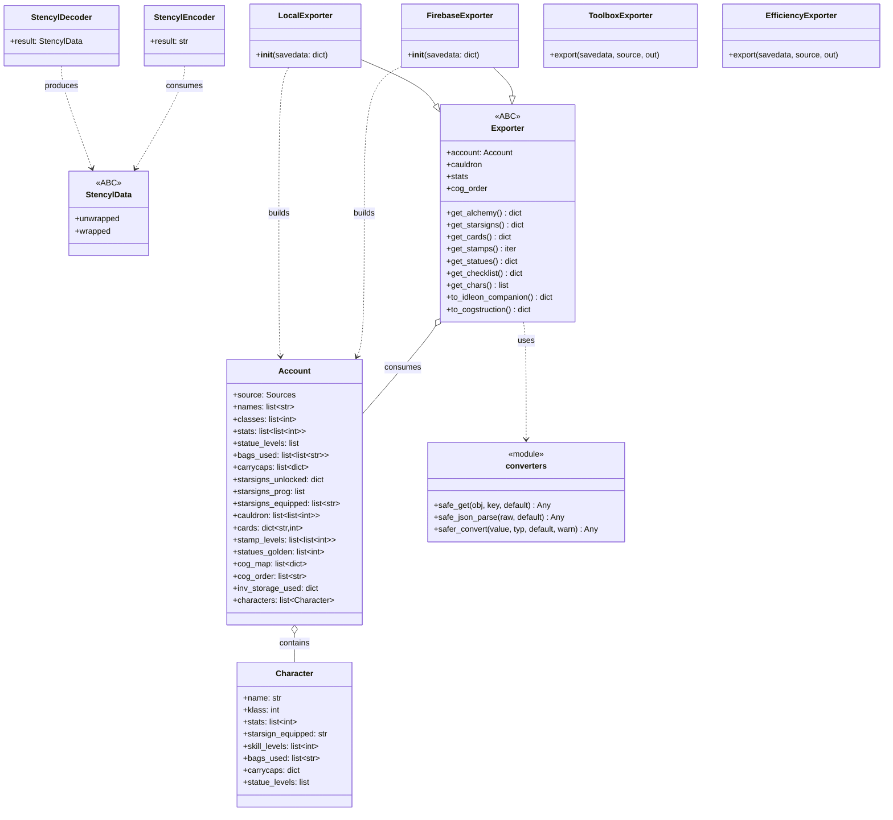
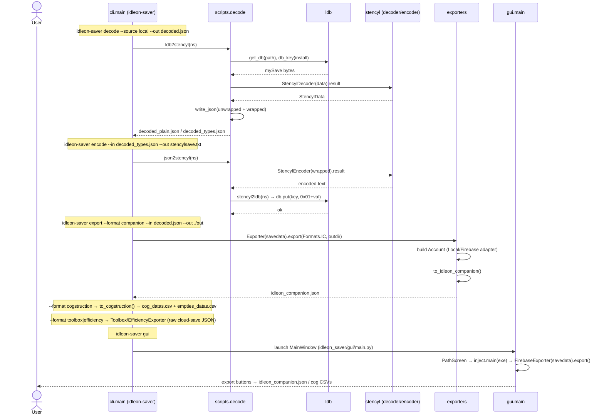

# Design — `idleon-saver` Rewrite (Architecture + Task Decomposition)

**Author:** 高见远 (Gao), Software Architect
**Status:** Draft for engineering sign-off
**Source docs:** `docs/prd.md`, `idleon_saver/ldb.py`, `idleon_saver/stencyl/*`, `idleon_saver/scripts/*`, `idleon_saver/data/__init__.py`, `idleon_saver/gui/*`, `idleon_saver/utility.py`, `tests/*`
**Hard constraint:** The four existing test files (`test_stencyl`, `test_scripts`, `test_export`, `test_gui`) and the three fixtures (`tests/data/{local.json, firebase.json, stencylsave.txt}`) are the contract. Their import paths MUST remain valid.

---

## 1. Implementation Approach + Framework

**Language/framework decision:** Keep **Python** (no web framework). Packaging becomes a proper installable `pyproject.toml` with a `console_scripts` entry. No new runtime web deps.

**Decode core is FROZEN (confirmed).** `idleon_saver/ldb.py` and `idleon_saver/stencyl/{common,decoder,encoder}.py` are kept **verbatim** (`KEEP`). `StencylDecoder(data).result` → `StencylData`, and `StencylEncoder(wrapped).result` → text, must remain **lossless** (asserted by `test_stencyl.py` and `test_scripts.py`). Any rewrite touching these files is out of scope.

**Key technical challenges & choices:**

| Challenge | Decision |
|---|---|
| Preserve lossless Haxe/Stencyl round-trip | Freeze `stencyl/` + `ldb.py` verbatim; no changes permitted. |
| Reuse existing parsing/export logic without breaking tests | Port `scripts/export.py` (the `Exporter` ABC + `LocalExporter`/`FirebaseExporter`) into a new `exporters/` package, and keep `idleon_saver/scripts/export.py` as a **thin re-export shim** so `from idleon_saver.scripts.export import Exporter, exporters, get_cog_type, ...` (used by `test_export.py`) still resolves. Same shim approach for `scripts/decode.py`, `scripts/encode.py` (pinned by `test_scripts.py`). |
| Static game-data may be missing on disk | Vendor JSON into `idleon_saver/data/vendored/` and load **defensively**: missing file/dir → empty `{}` default + `log.warning`, never raise (RQ-4). This applies both to the glob load AND to every downstream derivation (`statues`, `card_reqs`, `vial_names`, `stamps`, `bag_maps`, `starsign_names`, ...). |
| Intermediate model for stable exporter input | Introduce a normalized, source-agnostic `Account`/`Character` model that the two source adapters (`LocalExporter`/`FirebaseExporter`) *produce* and that every exporter *consumes*. Pure defensive `get_xxx(account)` parsers live in `core/parsers.py` (TB/IE pattern). |
| Two new exporters (Toolbox / Efficiency) | Both simply **re-emit the raw cloud-save JSON** (`firebase.json` shape: flat `key→JSON-string`). Firebase source = pass-through; local source = best-effort unwrapped decoded JSON (documented limitation, RQ-5). They do NOT need the parsed `Account` model. |
| Single public CLI without duplicating argparse | Keep `scripts/` as the canonical home for the pipeline modules (because tests pin `idleon_saver.scripts.*` paths) and add **one** `cli.py` as the `console_scripts` entry. `cli.py` is the sole owner of argument parsing; `scripts/*.py` `main()` functions delegate to it. No duplicated grammar. |
| GUI modernization without breaking `test_gui.py` | Keep `gui/main.py` runnable as `python idleon_saver/gui/main.py` (telenium launches it directly). Preserve the `MainWindow` attributes the test monkeypatches: `download_savedata`, `userdir`, `action`, `export`, `get_json`. Keep `ScreenManager` flow: Start → Path → End. |

**Architecture pattern:** Pipeline + Adapter. The decode/encode pipeline is a frozen library; the new `exporters/` + `core/` layers are adapter/parser layers over a stable intermediate model.

---

## 2. Proposed File List (relative to project root)

Legend: **KEEP** = verbatim, do not touch · **PORT** = port functionality, modernize imports, keep public API · **NEW** = create.

### Frozen decode core (KEEP)
| Path | Status | Notes |
|---|---|---|
| `idleon_saver/ldb.py` | KEEP | `get_db`, `db_key` verbatim. |
| `idleon_saver/stencyl/__init__.py` | KEEP | empty stub. |
| `idleon_saver/stencyl/common.py` | KEEP | `StencylData` hierarchy verbatim. |
| `idleon_saver/stencyl/decoder.py` | KEEP | `StencylDecoder` verbatim. |
| `idleon_saver/stencyl/encoder.py` | KEEP | `StencylEncoder` verbatim. |

### Defensive data layer (PORT)
| Path | Status | Notes |
|---|---|---|
| `idleon_saver/data/__init__.py` | PORT | Rewrite load to glob `idleon_saver/data/vendored/maps/*.json` + `vendored/wiki/**/*.json`; defensive derivation; keep ALL exported names (`idleon_data`, `wiki_data`, `skill_names`, `starsign_ids`, `starsign_names`, `constellation_names`, `cog_datas_map`, `cog_boosts`, `cog_type_map`, `Bags`, `bag_maps`, `statues`, `card_reqs`, `vial_names`, `stamp_names`, `pouch_names`, `pouch_sizes`). Keep hardcoded constants verbatim (RQ-6). |
| `idleon_saver/data/vendored/maps/*.json` | KEEP | Already on disk (alchemy, bags, cards, classNames, itemNames, monsterNames, stampList, statueList). |
| `idleon_saver/data/vendored/wiki/**/*.json` | KEEP (lead copies) | Will be added by team-lead; design must tolerate absence. |

### Intermediate model + defensive helpers (NEW)
| Path | Status | Notes |
|---|---|---|
| `idleon_saver/core/__init__.py` | NEW | package marker. |
| `idleon_saver/core/model.py` | NEW | `Account` + `Character` dataclasses (source-agnostic). |
| `idleon_saver/core/converters.py` | NEW | `safe_get`, `safe_json_parse`, `safer_convert`, `try_to_parse`. |
| `idleon_saver/core/parsers.py` | NEW | pure `get_xxx(account)` parsers + module-level helpers (`get_cog_type`, `get_empties`, `parse_player_starsigns`, `get_starsign_from_index`, `get_baseclass`, `get_classname`, `get_cardtier`, `get_pouchsize`, `get_pouches`), `detect_source(savedata)`. |
| `idleon_saver/exceptions.py` | NEW | exception hierarchy. |
| `idleon_saver/log.py` | NEW | `get_logger`, `configure_logging`. |

### Exporters (NEW package + PORT shim)
| Path | Status | Notes |
|---|---|---|
| `idleon_saver/exporters/__init__.py` | NEW | re-exports `Exporter, LocalExporter, FirebaseExporter, exporters, get_cog_type, get_empties, get_starsign_from_index, parse_player_starsigns, Formats`; also exposes `ToolboxExporter`, `EfficiencyExporter`. |
| `idleon_saver/exporters/base.py` | NEW | Ported `Exporter` ABC + `LocalExporter` + `FirebaseExporter`, refactored to build/consume an `Account`. **Keep all test-facing members** (`cauldron`, `stats`, `cog_order`, `get_alchemy`, `get_stamps`, `get_chars`, `to_idleon_companion`, `to_cogstruction`, `get_checklist`, `char_map`, `build_skills`, `build_char`, `get_player_constellations`). |
| `idleon_saver/exporters/companion.py` | NEW | `IdleonCompanionExporter` (wraps `to_idleon_companion`). |
| `idleon_saver/exporters/cogstruction.py` | NEW | `CogstructionExporter` (wraps `to_cogstruction` → 2 CSVs). |
| `idleon_saver/exporters/toolbox.py` | NEW | `ToolboxExporter` — re-emit raw cloud-save JSON. |
| `idleon_saver/exporters/efficiency.py` | NEW | `EfficiencyExporter` — re-emit raw cloud-save `Cloudsave` JSON. |
| `idleon_saver/scripts/export.py` | PORT → shim | Becomes `from idleon_saver.exporters import (...)`. Keeps `Formats` importable at old path (the `.kv` imports `idleon_saver.scripts.export.Formats`). |

### CLI pipeline modules (PORT, canonical home kept in `scripts/`)
| Path | Status | Notes |
|---|---|---|
| `idleon_saver/scripts/__init__.py` | KEEP | empty stub. |
| `idleon_saver/scripts/decode.py` | PORT | Keep `ldb2stencyl`, `stencyl2json`, `read_stencyl`, `write_json` signatures (`main(args: Namespace)`). `main` delegates arg parsing to `cli`. |
| `idleon_saver/scripts/encode.py` | PORT | Keep `json2stencyl`, `stencyl2ldb`. |
| `idleon_saver/scripts/inject.py` | PORT | Keep `main(exe_path)`, `jsonify`, `jsonify_values`, `wait_for_idle`. (ChromeController fragility tracked in §8.) |
| `idleon_saver/scripts/inject.js` | KEEP | verbatim. |
| `idleon_saver/scripts/mangle.py` | PORT | Keep `StencylMangler`, `main`. |
| `idleon_saver/scripts/trim_save.py` | PORT | Keep `trim_local`, `trim_firebase`, `trimmers`. |

### Unified CLI entry (NEW)
| Path | Status | Notes |
|---|---|---|
| `idleon_saver/cli.py` | NEW | `console_scripts` entry `idleon-saver`. Subcommands: `decode`, `encode`, `export`, `gui`. Sole owner of argparse grammar (reuses `utility.Args`/`arg_adders`). |

### Utility (PORT)
| Path | Status | Notes |
|---|---|---|
| `idleon_saver/utility.py` | PORT | Keep `ROOT_DIR`, `Sources`, `Formats`, `Args`, `arg_adders`, `get_args`, `friendly_name`, `user_dir`, `logs_dir`, `zip_from_iterable`, `dict_sorted`, `from_keys_in`, `chunk`, `resolved_path`, `wait_for`, custom Actions. Add a call to `log.configure_logging` inside `get_args` (replace the inline StreamHandler). |
| `idleon_saver/__init__.py` | PORT | add `__version__` (read from importlib.metadata). |

### GUI (PORT)
| Path | Status | Notes |
|---|---|---|
| `idleon_saver/gui/main.py` | PORT | Modernize widgets/layout; keep `MainWindow` + `download_savedata`/`userdir`/`action`/`export`/`get_json`; keep `idleon_saver/gui/main.py` directly runnable. |
| `idleon_saver/gui/main.kv` | PORT | Modernize; update `#:import Formats idleon_saver.scripts.export.Formats` only if `Formats` moves (it stays in `scripts.export` shim, so this line is unchanged). |

### Packaging & tests
| Path | Status | Notes |
|---|---|---|
| `pyproject.toml` | PORT | Add `[tool.poetry.scripts] idleon-saver = "idleon_saver.cli:main"`; keep deps; add `[tool.pytest.ini_options]` for tests; ensure `pytest` group present. |
| `tests/conftest.py` | KEEP | behavior preserved (pins `idleon_saver.scripts.decode.encode`, `idleon_saver.scripts.export.Exporter`, `idleon_saver.ldb`, `idleon_saver.utility.ROOT_DIR`). |
| `tests/test_stencyl.py` | KEEP | verbatim. |
| `tests/test_scripts.py` | KEEP | verbatim (pins `idleon_saver.scripts.decode`/`encode`). |
| `tests/test_export.py` | KEEP | verbatim (pins `idleon_saver.scripts.export.*` + `idleon_saver.data.cog_type_map`). |
| `tests/test_gui.py` | KEEP | verbatim (launches `idleon_saver/gui/main.py` via telenium). |
| `tests/data/{local.json,firebase.json,stencylsave.txt}` | KEEP | real fixtures. |
| `tests/test_data.py` | NEW | defensive-loading tests: missing vendored dir → `{}` + warning; derivation never raises. |
| `tests/test_cli.py` | NEW | `idleon-saver decode|encode|export|gui --help` smoke + round-trip via fixtures. |
| `tests/test_converters.py` | NEW | `safe_get` / `safe_json_parse` / `safer_convert` tests. |

### Resolution of `scripts/` vs `cli.py` (the duplication question)
**Recommendation: KEEP `scripts/` as the canonical home for the pipeline modules; ADD `cli.py` as the single console entry.** Rationale:
- `test_scripts.py` pins `idleon_saver.scripts.decode` and `idleon_saver.scripts.encode`; `test_export.py` pins `idleon_saver.scripts.export`. Folding these into `idleon_saver/core` or `_internal` would break the test contract and force rewriting the pinned tests.
- `cli.py` becomes the **only** place that builds the argparse grammar. Each `scripts/*.py` keeps its `main(args)` for `python -m idleon_saver.scripts.X` convenience but delegates parsing to `cli` (no duplicated argument definitions).
- Result: zero duplication, tests green, one public `idleon-saver` command.

---

## 3. Data Structures / Model Classes



### Defensive helper signatures (NEW `core/converters.py`)
```python
def safe_get(obj: Any, key: Any, default: Any = None) -> Any:
    """Return obj[key] when obj is a mapping and key present; else default. Never raises KeyError/TypeError."""

def safe_json_parse(raw: Union[str, bytes, None], default: Any = None) -> Any:
    """json.loads(raw); on JSONDecodeError/TypeError return default. Never raises."""

def safer_convert(value: Any, typ: Callable[[Any], Any], default: Any = None, *, warn: bool = True) -> Any:
    """Return typ(value); on Exception return default and (optionally) log.warning. Never raises."""

def try_to_parse(parser: Callable[[Any], Any], value: Any, default: Any = None) -> Any:
    """Run parser(value); swallow exceptions, return default on failure (TB `tryToParse` pattern)."""
```

### `Account` / `Character` field contract (`core/model.py`)
`Account` is a `@dataclass` whose fields are exactly the normalized outputs the source adapters extract (see `Exporter.__init__` in `scripts/export.py` today). The source adapters (`LocalExporter`/`FirebaseExporter`) populate it; `Exporter` copies the needed fields onto itself as **plain writable instance attributes** (`self.cauldron`, `self.stats`, `self.cog_order`, `self.cog_map`, `self.stamp_levels`, `self.statues_golden`, `self.starsigns_unlocked`, `self.starsigns_prog`, `self.starsigns_equipped`, `self.cards`, `self.classes`, `self.names`, `self.bags_used`, `self.carrycaps`, `self.inv_storage_used`) so existing tests that poke `exporter.cauldron = []` / `exporter.stats = [[]]` keep working. `Character` is a derived convenience view (one per player).

---

## 4. Program Call Flow



---

## 5. Task List (ordered, phased, with dependencies)

Each task names the exact files to create/modify and what goes in them. This is the contract the engineer executes.

### Phase 0 — Freeze decode core (verification gate, no code change)
- **T0** — *Verify frozen core.* Files: `idleon_saver/ldb.py` (KEEP), `idleon_saver/stencyl/{__init__,common,decoder,encoder}.py` (KEEP). Action: confirm `test_stencyl.py` + `test_scripts.py` pass on current tree; record that these files are out of scope for editing. Deps: none. Priority: P0.

### Phase 1 — Packaging & scaffolding
- **T1** — *Project scaffolding + packaging.* Files: `pyproject.toml` (PORT — add `idleon-saver = "idleon_saver.cli:main"` to `[tool.poetry.scripts]`; add `[tool.pytest.ini_options]`; keep all deps), `idleon_saver/__init__.py` (PORT — add `__version__` via `importlib.metadata`), `idleon_saver/log.py` (NEW — `get_logger`, `configure_logging`), `idleon_saver/exceptions.py` (NEW — hierarchy below), `idleon_saver/core/__init__.py` (NEW — marker). Deps: T0. Priority: P0.

### Phase 2 — Defensive data layer
- **T2** — *Defensive vendored data loader.* File: `idleon_saver/data/__init__.py` (PORT). Action: replace `idleon-data`/`IdleonWikiBot` globbing with `idleon_saver/data/vendored/maps/*.json` and `idleon_saver/data/vendored/wiki/**/*.json`; if dir/file missing → `{}` + `log.warning`, never raise; make every derivation (`statues`, `card_reqs`, `vial_names`, `stamps`, `stamp_names`, `starsign_names`, `bag_maps`) use `safe_get`/`.get(..., {})` so a missing wiki file never raises; keep ALL exported names and all hardcoded constants verbatim (RQ-6). Deps: T1. Priority: P0 (P1-3).

### Phase 3 — Intermediate model + converters + parsers
- **T3** — *Model + defensive helpers + parsers.* Files: `idleon_saver/core/model.py` (NEW — `Account`, `Character` dataclasses per §3), `idleon_saver/core/converters.py` (NEW — `safe_get`, `safe_json_parse`, `safer_convert`, `try_to_parse`), `idleon_saver/core/parsers.py` (NEW — `get_cog_type`, `get_empties`, `parse_player_starsigns`, `get_starsign_from_index`, `get_baseclass`, `get_classname`, `get_cardtier`, `get_pouchsize`, `get_pouches`, `detect_source`). Move the pure helpers out of `scripts/export.py` into `parsers.py` (keep re-exports in the shim). Deps: T2. Priority: P1 (P1-4).

### Phase 4 — Exporters
- **T4** — *Exporters package (port IC/Cog + add Toolbox/Efficiency).* Files: `idleon_saver/exporters/__init__.py` (NEW — re-export shim), `idleon_saver/exporters/base.py` (NEW — port `Exporter`/`LocalExporter`/`FirebaseExporter` to build/consume `Account`; keep test-facing members), `idleon_saver/exporters/companion.py` (NEW), `idleon_saver/exporters/cogstruction.py` (NEW), `idleon_saver/exporters/toolbox.py` (NEW — raw cloud-save JSON pass-through for firebase / best-effort unwrapped for local), `idleon_saver/exporters/efficiency.py` (NEW — same as Toolbox, `Cloudsave` shape), `idleon_saver/scripts/export.py` (PORT → shim `from idleon_saver.exporters import (...)`). Port `get_cards` to use `safe_get(wiki_data, "EnemyDetails", {})`; port `get_classname` to use `idleon_data.get("classNames", {}).get(...)`. Deps: T3 (and T2 for data). Priority: P0 (P0-3/4/5) + P1 (P1-1/2).

### Phase 5 — Unified CLI
- **T5** — *Unified CLI entry.* Files: `idleon_saver/cli.py` (NEW — subcommands `decode`/`encode`/`export`/`gui`; sole argparse owner reusing `utility.Args`/`arg_adders`; `gui` calls `idleon_saver.gui.main`), `idleon_saver/utility.py` (PORT — `get_args` calls `log.configure_logging`; keep `Args`/`Sources`/`Formats`/`arg_adders`). `scripts/decode.py`, `scripts/encode.py` `main()` delegate parsing to `cli`. Deps: T4. Priority: P1 (P1-5).

### Phase 6 — GUI modernization
- **T6** — *Modernize Kivy GUI.* Files: `idleon_saver/gui/main.py` (PORT — keep `MainWindow`, `download_savedata`, `userdir`, `action`, `export`, `get_json`; modernize widgets/layout; route logs via `log`), `idleon_saver/gui/main.kv` (PORT — modernize; `Formats` import path unchanged via shim). Deps: T4. Priority: P0 (P0-8) + P1.

### Phase 7 — Tests & CI
- **T7** — *Tests + CI.* Files: `tests/test_data.py` (NEW — missing vendored dir → `{}`+warning; derivations never raise), `tests/test_cli.py` (NEW — `idleon-saver {decode,encode,export,gui} --help`; round-trip via fixtures), `tests/test_converters.py` (NEW — `safe_get`/`safe_json_parse`/`safer_convert`), `tests/conftest.py` (KEEP), `tests/test_{stencyl,scripts,export,gui}.py` (KEEP), `tests/data/*` (KEEP). Add CI step running `pytest` (headless: skip `test_gui` under `CI` env or when display unavailable). Deps: T5, T6. Priority: P0 (P0-7).

**Dependency graph:** `T0 → T1 → T2 → T3 → T4 → {T5, T6} → T7`. `T4` also depends on `T2` (data). No cycles.

---

## 6. Dependency Packages

Runtime (keep existing `pyproject` entries):
- `plyvel` ^1.4 (LevelDB reader; win32 uses the vendored wheel).
- `kivy` ^2.1 (base extras; GUI).
- `chromecontroller` (git) + `pywin32` >=300 (win32) — only for `inject.py` (GUI save retrieval).

New runtime deps: **none required** — CLI uses stdlib `argparse` (reused via `utility.get_args`), so we deliberately avoid adding `typer` to keep the `main(args: Namespace)` contract that the tests rely on. (If the team later wants `typer`, it is an additive, non-breaking change; documented as optional.)

Dev/test (already present; confirm in `pyproject`):
- `pytest` ^6.2.4, `pytest-cov` — test runner.
- `telenium` (git) — `test_gui.py` (headless-skip under CI).
- `black`, `mypy` — formatting/type hints (keep).

---

## 7. Shared Conventions

**Naming**
- Modules: `snake_case`. Classes: `PascalCase`. Functions: `snake_case`. Constants/enums: `UPPER` or `PascalCase` enum members (match existing `Sources`, `Formats`, `Args`).
- Public pipeline functions keep their historical names: `ldb2stencyl`, `stencyl2json`, `json2stencyl`, `stencil2ldb`→`stencyl2ldb`, `read_stencyl`, `write_json`, `trim_local`, `trim_firebase`, `get_cog_type`, `get_empties`, `parse_player_starsigns`, `get_starsign_from_index`.

**Import paths**
- Frozen core: `idleon_saver.ldb`, `idleon_saver.stencyl.decoder`, `idleon_saver.stencyl.encoder`, `idleon_saver.stencyl.common`.
- Pipeline: `idleon_saver.scripts.decode`, `idleon_saver.scripts.encode`, `idleon_saver.scripts.export` (shim), `idleon_saver.scripts.inject`, `idleon_saver.scripts.mangle`, `idleon_saver.scripts.trim_save`.
- New layers: `idleon_saver.core.model`, `idleon_saver.core.converters`, `idleon_saver.core.parsers`, `idleon_saver.exporters`, `idleon_saver.cli`, `idleon_saver.log`, `idleon_saver.exceptions`.
- `data/__init__.py` exposes every name the exporters import: `Bags, bag_maps, card_reqs, cog_boosts, cog_datas_map, cog_type_map, constellation_names, idleon_data, pouch_names, pouch_sizes, skill_names, stamp_names, starsign_ids, starsign_names, statues, vial_names, wiki_data`. Keep this surface stable.

**Error handling — `idleon_saver/exceptions.py`**
```python
class IdleonSaverError(Exception): ...            # base
class DecodeError(IdleonSaverError): ...          # stencyl/ldb failures
class EncodeError(IdleonSaverError): ...          # re-encode failures
class DataLoadError(IdleonSaverError): ...        # vendored data missing/corrupt
class ExportError(IdleonSaverError): ...          # exporter failures
class SourceError(IdleonSaverError): ...          # unknown/unsupported source
class ChromeControllerError(IdleonSaverError): ...# inject.py failures
```
`ldb.py` `get_db` keeps raising `IOError`/`KeyError` (test pinned); wrap at CLI boundary into `DecodeError` for user-facing messages. `data/__init__.py` must **not** raise `DataLoadError` on missing files (RQ-4) — it logs and continues; `DataLoadError` is reserved for truly unrecoverable cases.

**Logging — `idleon_saver/log.py`**
- `get_logger(__name__)` returns a module logger; never configure handlers at import time.
- `configure_logging(level=logging.INFO, to_stdout=False)` sets up the root handler; called once from `utility.get_args` (CLI) and from `gui.main` (Kivy route). `data/__init__.py` calls `get_logger(__name__).warning(...)` on missing files — no handler needed at import.
- All "data missing" events go through `log.warning`, never `print`, never raise.

**Defensive data contract (RQ-4)**
- `idleon_saver/data/vendored/maps/*.json` and `vendored/wiki/**/*.json` are loaded with `safe_json_parse`; missing dir/file → `{}` + `log.warning`.
- Every derivation from `wiki_data`/`idleon_data` uses `.get(key, default)` with `default` of the correct shape (`[]` / `{}`) and a `log.warning` when the key was absent.
- Hardcoded constants (`skill_names`, `starsign_ids`, `constellation_names`, `cog_datas_map`, `cog_boosts`, `cog_type_map`) remain verbatim and are not data-driven.

**CLI contract**
- `idleon-saver decode [--source local|firebase] [--out decoded.json]` → runs `ldb2stencyl` + `stencyl2json`.
- `idleon-saver encode [--in decoded.json] [--out stencylsave.txt]` → runs `json2stencyl` + `stencyl2ldb`.
- `idleon-saver export [--format companion|cogstruction|toolbox|efficiency] [--in ...] [--out ...]` → dispatches to `exporters`.
- `idleon-saver gui` → launches `idleon_saver.gui.main`.

---

## 8. Open Items / Risks

1. **Toolbox / Efficiency exact field fidelity (RQ-5).** The two websites ingest the *raw* cloud-save JSON (flat `key→JSON-string`, i.e. the `firebase.json` fixture). For a **firebase** source we pass through verbatim (exact). For a **local** source there is no cloud-save envelope, so we emit the best-effort unwrapped decoded JSON — this will **not** be byte-identical to a real cloud save and must be documented as a limitation in the exporter docstrings and CLI help. *Risk: low* (matches resolved RQ-5).
2. **ChromeController / `inject.py` fragility.** `inject.py` drives the live game via Chrome DevTools to pull the firebase save; it depends on `ChromeController` (git dep), `win32gui`, and the game's internal Firebase calls (`inject.js`). This only runs on Windows with the game installed and is untested in CI. `test_gui.py` monkeypatches `window.download_savedata`, so the pipeline is testable without ever launching the game. *Risk: medium* — keep `inject.py` as PORT, isolate it behind `gui.main.download_savedata`, and never let its failure crash the rest of the tool.
3. **GUI test skipping under headless CI.** `test_gui.py` uses `telenium` which needs a display; under `CI` (or `headless`) env, skip the `test_gui` module (`pytest -k "not gui"` or `@pytest.mark.skipif(os.environ.get("CI"))`). Document in CI config. *Risk: low*.
4. **`data/__init__.py` derivation crash surface.** The biggest correctness risk in the rewrite is an unguarded derivation (`wiki_data["Statue"]`, etc.) raising when vendored wiki files are absent. Mitigation: T2 makes **every** derivation defensive; `tests/test_data.py` asserts no raise with an empty vendored tree. *Risk: medium until T2 lands*.
5. **`Account` model vs existing `Exporter` flat attributes.** To keep `test_export.py` green (it mutates `exporter.cauldron`/`exporter.stats` and reads `get_alchemy`/`get_chars`), `Exporter` must keep those as **plain writable attributes** initialized from the `Account` (not read-only properties). T4 encodes this rule explicitly. *Risk: low if rule followed*.
6. **`Formats` import in `main.kv`.** The `.kv` does `#:import Formats idleon_saver.scripts.export.Formats`. Keeping `scripts/export.py` as a re-export shim that exposes `Formats` means the `.kv` line is unchanged. If `Formats` is ever moved, the `.kv` import must be updated in the same task. *Risk: low*.
7. **plyvel on Windows.** The win32 wheel is vendored (`wheels/...`). Keep the poetry marker; verify install in CI matrix if Windows runners available. *Risk: low*.
8. **telenium / chromecontroller git deps in lockfile.** These are git sources; `poetry.lock` already pins them. Keep them out of the critical decode/export path so their absence doesn't block the core. *Risk: low*.
