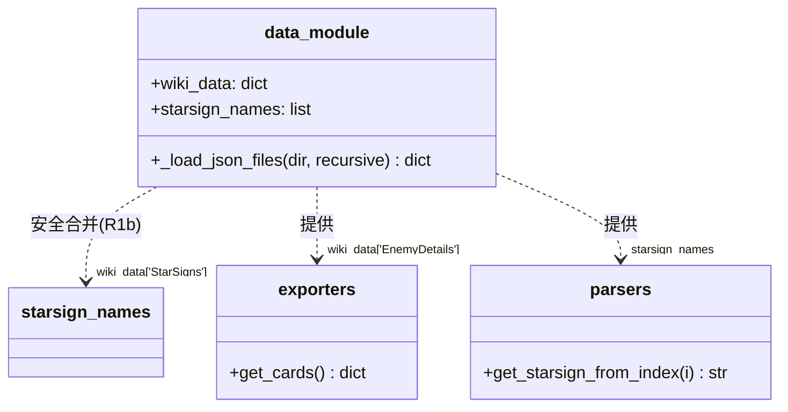
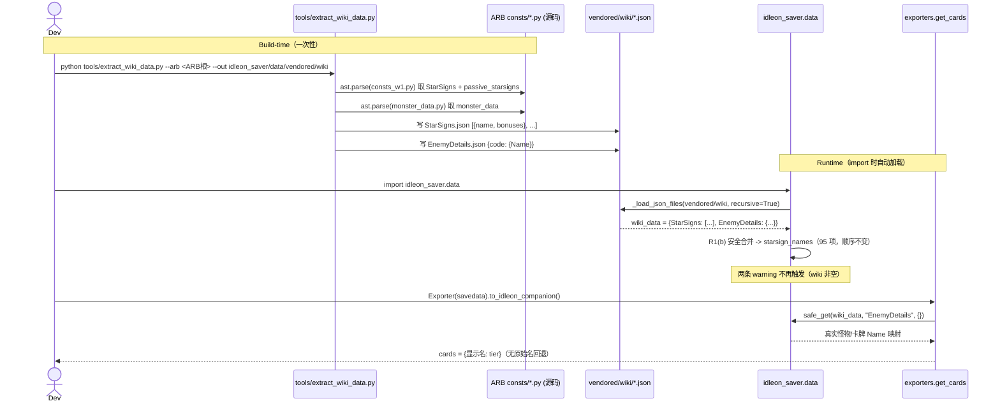

# 增量设计 — 补全 vendored/wiki 静态数据（消除降级项）

**文档类型**：增量设计 + 增量任务列表（仅描述相对 `docs/design.md` T0–T7 的变更）
**关联文档**：`docs/prd.md`、`docs/design.md`、`docs/incremental-prd-data.md`（产品经理许清楚，本次以它为准，但 P0-b 描述按主理人基线修正）
**作者**：高见远（Gao），架构师
**语言**：简体中文
**状态**：Draft，待主理人/用户拍板 §8 待明确事项

---

## 0. 设计决策摘要（R1 / R2）

| 风险 | 决策 | 理由 |
|---|---|---|
| **R1 — StarSigns 安全** | **采用方案 (b)：wiki 优先 + `starsign_ids` 兜底拼接的安全合并**（需最小改动 `idleon_saver/data/__init__.py` 291–303 行，并配套 1 行 `parsers.py` 防御加固） | `starsign_names` 被 `get_starsign_from_index(i)` 以**位置**索引（`starsign_ids[starsign_names[i]]`，见 `core/parsers.py:70`）。ARB `StarSigns` 为 94 项且**顺序与 `starsign_ids` 不同**（ARB[0]=`The_Buff_Guy`，而 `starsign_ids`[0]=`The_Book_Worm`）。若整体替换会**错位星座 index→id 映射**，导致解析错误。方案 (a)（"仅保证 ≥57 覆盖"）不够——它默认顺序一致，实际不一致。方案 (b) 保留 `starsign_ids` 的权威顺序、用 wiki 名富化、并把 wiki-only 项（含 W7 Cosmos）**追加到末尾**，既不会变短也不会打乱既有 index。 |
| **R2 — EnemyDetails 字段对齐** | **`EnemyDetails.json` = ARB `monster_data.py::monster_data` 直接落盘**（无需字段变换） | `monster_data` 是 `dict`，键为怪物内部码（如 `ForgeA`、`Bandit_Bob`），值为 `{"Name": 显示名}`。`get_cards`（`exporters/base.py:213-228`）正是 `enemy_details.get(name)["Name"]`——键即 `self.cards` 的内部卡名，值取 `Name` 作为导出显示键。**schema 1:1 匹配**，生成即能用。可选 P1 增强：用 `consts_monster_data.py::card_name_overrides` 覆写显示名。 |

> 主理人已核实基线（以它为准）：`bag_maps` 未损坏（INV=37 / STORAGE=44 / GEM 故意空），**无需改 `vendored/maps/bags.json`**；唯一真实降级是 `vendored/wiki` 缺失导致 `wiki_data={}`。本设计**只生成 `vendored/wiki/*.json` + 一次性抽取脚本 + 数据层最小安全合并**，冻结 `ldb.py` / `stencyl/*` 严禁改。

---

## 1. 实现方案 + 框架选型

**目标**：消除两条导入 warning（`Vendored data directory missing`、`No StarSigns wiki data`）与 `get_cards` 的 `EnemyDetails` 空数据，让 `wiki_data` 非空、星座名来自 wiki 而非 `starsign_ids` 回退。

**技术选型**：

| 挑战 | 决策 |
|---|---|
| 抽取 ARB `consts/*.py` 但**不能 import**（可能依赖 django 等重依赖） | 抽取脚本纯用 **`ast`** 解析源码、定位目标赋值节点（`ast.parse` + `ast.walk` 找 `ast.Assign` 中指定 `ast.Name`），`ast.literal_eval` 取值。**绝不 `import` ARB 模块**，规避 django 依赖与运行环境耦合。 |
| 抽取脚本不是运行时依赖 | 放在 **`tools/`**（非 `idleon_saver/` 包内），是 **build-time 一次性工具**，不被 `idleon_saver` 导入，不进运行时、不进 `pyproject` 运行时依赖。 |
| `wiki_data` 加载契约（已落地，T2） | 复用现有 `_load_json_files(_VENDORED_DIR / "wiki", recursive=True)`：缺失目录→`{}`+warning；剥离 `__comment`；若存在顶层 `data` 键则展开。新增 JSON 直接落盘为该目录即可被自动加载。 |
| R1 顺序安全 | 见 §0 + §3。在 `data/__init__.py` 做**保留 `starsign_ids` 顺序的安全合并**，绝不整体替换。 |
| 无新运行时依赖 | 仅标准库：`ast` / `json` / `pathlib` / `argparse`。运行时字节数与现有 `pyproject` 完全一致。 |

**架构模式**：数据生成管线（build-time 抽取脚本）→ 静态 JSON 资产 → 已有防御性加载层（`data/__init__.py`）→ 已有导出层（消费 `wiki_data`）。本次**不触碰**导出逻辑与冻结核心。

---

## 2. 文件列表及相对路径

图例：**NEW** = 本次新增 · **MOD** = 本次最小改动（数据层，非冻结核心）

| 路径 | 状态 | 说明 |
|---|---|---|
| `idleon_saver/data/vendored/wiki/StarSigns.json` | NEW | wiki 星座表：`[{name, bonuses}, ...]`。由 ARB `consts_w1.py::StarSigns` + `passive_starsigns` 转换生成。被 `data/__init__.py` 加载为 `wiki_data["StarSigns"]`。 |
| `idleon_saver/data/vendored/wiki/EnemyDetails.json` | NEW | wiki 怪物/卡牌维度：`{内部码: {Name: 显示名}, ...}`。由 ARB `monster_data.py::monster_data` 直接落盘。被 `get_cards` 消费为 `wiki_data["EnemyDetails"]`。 |
| `idleon_saver/data/vendored/wiki/Items.json` | NEW（P1 可选） | 物品维度增厚（可选）。来源 `raw_item_data.py::raw_item_data`。`itemNames.json` 已在 `maps/` 中，故为可选增厚，本期可不实现。 |
| `tools/extract_wiki_data.py` | NEW | 一次性抽取脚本（build-time，不进运行时）。`ast` 解析 ARB `consts/*.py` → 写出上面两个（或三个）JSON。 |
| `idleon_saver/data/__init__.py` | MOD | **仅改 291–303 行**（R1 方案 b 安全合并），其余不动。 |
| `idleon_saver/core/parsers.py` | MOD（推荐 1 行加固） | `get_starsign_from_index` 第 70 行改为 `starsign_ids.get(starsign_names[i], starsign_names[i])`，使追加的 wiki-only 星座（如 `Seraph_Cosmos`）自解析、不 `KeyError`。 |

> 不改动：`idleon_saver/ldb.py`、`idleon_saver/stencyl/*`（冻结）、`idleon_saver/exporters/base.py` 的 `get_cards` 逻辑、`vendored/maps/bags.json`、`cli.py`、`gui/*`。

### 2.1 `data/__init__.py` 具体改动（替换 291–303 行）

**原代码（291–303）**：
```python
_starsign_list = wiki_data.get("StarSigns", [])
if isinstance(_starsign_list, list) and _starsign_list:
    starsign_names = [
        sign["name"].replace(" ", "_")
        for sign in _starsign_list
        if isinstance(sign, dict) and "name" in sign
    ]
else:
    if _starsign_list is not None:
        logger.warning(
            "No StarSigns wiki data; deriving starsign_names from starsign_ids"
        )
    starsign_names = list(starsign_ids.keys())
```

**新代码（R1 方案 b：安全合并）**：
```python
# R1(b): wiki StarSigns 与权威 starsign_ids 顺序的安全合并。
# `starsign_names` 被 get_starsign_from_index 以【位置】索引
# (starsign_ids[starsign_names[i]])，前 len(starsign_ids) 项必须保持
# starsign_ids 声明顺序且列表绝不缩短，否则星座 index->id 错位/越界。
# ARB wiki 列表更长(94+3)但顺序不同，整体替换会破坏映射，故：
#   1) 按 starsign_ids 权威顺序填充（wiki 有则富化 name，无则回退硬编码 id）；
#   2) 将 wiki-only 项（W7 Cosmos 被动星座、Major/Minor 变体）追加到末尾。
_starsign_list = wiki_data.get("StarSigns", [])
_wiki_signs: dict = {}
if isinstance(_starsign_list, list):
    for _sign in _starsign_list:
        if isinstance(_sign, dict) and "name" in _sign:
            _wiki_signs[_sign["name"].replace(" ", "_")] = _sign
else:
    _starsign_list = []

_merged: list = []
_seen: set = set()
for _sid in starsign_ids:  # 权威顺序 -> 保持 index 映射不变
    _name = _wiki_signs.get(_sid, {}).get("name", _sid.replace("_", " "))
    _norm = _name.replace(" ", "_")
    _merged.append(_norm)
    _seen.add(_norm)
# 追加 wiki-only 星座（Cosmos 被动、变体）到末尾，既有 index 不受影响
for _name in _wiki_signs:
    if _name not in _seen:
        _merged.append(_name)
        _seen.add(_name)

if not _wiki_signs:
    logger.warning(
        "No StarSigns wiki data; deriving starsign_names from starsign_ids"
    )
starsign_names = _merged
```

**配套 `core/parsers.py` 第 70 行加固（推荐，1 行）**：
```python
def get_starsign_from_index(i: int) -> str:
    # 追加的 wiki-only 星座（如 Seraph_Cosmos）不在 starsign_ids 中，
    # 用 .get 回退到自身，避免 KeyError 被 parse_player_starsigns 丢弃。
    return starsign_ids.get(starsign_names[i], starsign_names[i])
```

> 效果验证：`starsign_names` 变为 57（权威序）+ 38（wiki-only）= **95 项**，`starsign_names == list(starsign_ids.keys())` 为 **False**（满足验收 #3）；且前 57 项顺序与 `starsign_ids` 一致，星座 index 映射零错位。

---

## 3. 数据结构 / 接口（JSON Schema + 对接契约）

### 3.1 `vendored/wiki/StarSigns.json`

```json
[
  {"name": "The Buff Guy", "bonuses": ["+1% Total Damage", "+3 STR", "_"]},
  {"name": "Flexo Bendo",  "bonuses": ["+2% Movement Speed", "+3 AGI", "_"]},
  {"name": "Chronus Cosmos", "bonuses": ["..."]},
  {"name": "Seraph Cosmos",  "bonuses": ["..."]},
  "...": "..."
]
```

- **对接契约**：`data/__init__.py` 读取 `wiki_data["StarSigns"]`（list）。每行需含 `"name"`（字符串，可含空格；加载后 `.replace(" ", "_")`）。`bonuses` 为可选富化字段，当前导出层不读，保留供未来使用。
- **加载后**：`starsign_names[i]` = 第 i 项 `.replace(" ", "_")` 形式（经 §2.1 安全合并）。

### 3.2 `vendored/wiki/EnemyDetails.json`

```json
{
  "ForgeA":    {"Name": "Fire Forge"},
  "ForgeB":    {"Name": "Cinder Forge"},
  "Bandit_Bob":{"Name": "Bandit Bob"},
  "SoulCard1": {"Name": "Soul Card 1"},
  "...": {"Name": "..."}
}
```

- **对接契约**：`get_cards`（`exporters/base.py:215`）`enemy_details = safe_get(wiki_data, "EnemyDetails", {})`；对每张卡 `enemy = enemy_details.get(name)`，`cards[enemy["Name"]] = _cardtier(...)`。
- **键**：内部怪物/卡牌码（= 存档 `Cards[0]` 的键）。**值**：至少含 `"Name"`（显示名，作为导出键）。
- **缺失键**：`get_cards` 已 `continue` 并回退原始内部名，绝不崩溃（向后兼容）。

### 3.3 加载契约（已有，复用）



---

## 4. 程序调用流程（时序图）



---

## 5. 任务列表（有序、含依赖、按实现顺序）

| ID | 任务名 | 源文件 | 依赖 | 优先级 |
|---|---|---|---|---|
| **T0** | 抽取脚本骨架 | `tools/extract_wiki_data.py`（NEW：argparse `--arb`/`--out`、ARB 路径配置、`ast` 解析助手 `_load_py_assignments(path, name)`、输出目录创建） | 无 | P0 |
| **T1** | StarSigns 抽取 + 生成 | `tools/extract_wiki_data.py`（写 `StarSigns.json`）、`idleon_saver/data/vendored/wiki/StarSigns.json`（NEW） | T0 | P0 |
| **T2** | EnemyDetails（+可选 items）抽取 + 生成 | `tools/extract_wiki_data.py`（写 `EnemyDetails.json`；P1 可选 `Items.json`）、`vendored/wiki/EnemyDetails.json`（NEW） | T0 | P0 |
| **T3** | 接入 / 微调 data 层 | `idleon_saver/data/__init__.py`（MOD 291–303，R1b 安全合并）、`idleon_saver/core/parsers.py`（MOD 第 70 行 `.get` 加固） | T1, T2 | P0 |
| **T4** | 测试 / 验收 | `tests/test_data.py`（NEW 用例：import 无两条 warning；`starsign_names != list(starsign_ids.keys())`；`wiki_data["EnemyDetails"]` 非空且含 `Name`）、回归原有测试 | T3 | P0 |

**依赖图**：`T0 → {T1, T2} → T3 → T4`。

**说明**：
- T1：脚本解析 `consts_w1.py::StarSigns`（list-of-lists `[name,b1,b2,b3]` → 取 `[0]` 作 `name`，`[1:4]` 作 `bonuses`）+ `passive_starsigns`（3 个字符串 → `{name}`），合并写出 `StarSigns.json`。
- T2：脚本解析 `monster_data.py::monster_data`（dict → 原样写出 `EnemyDetails.json`）。可选 P1：用 `consts_monster_data.py::card_name_overrides` 覆写 `Name`（33 条）。
- T3：落地 §2.1 的 `data/__init__.py` 安全合并与 `parsers.py` 加固。
- T4：满足 `incremental-prd-data.md` §6 验收 #1/#3/#4（29 个测试全过、无 warning、`starsign_names` 不再回退）。

---

## 6. 依赖包

运行时（**无新增**）：
- 仅 Python 标准库：`ast`、`json`、`pathlib`、`argparse`（抽取脚本用）、`enum`、`typing`（已有）。

Build-time（抽取脚本，不进运行时/不进 `pyproject` 运行时依赖）：
- 同上标准库，无第三方包。

> 与 `docs/design.md` 的运行时依赖（`plyvel`/`kivy`/等）**完全不变**。

---

## 7. 共享知识（字段映射表）

### 7.1 ARB consts → wiki JSON 字段映射

| idleon-saver 维度 | 目标文件 | ARB 来源 | ARB 形态 → 目标形态 | 转换规则 |
|---|---|---|---|---|
| `wiki_data["StarSigns"]` | `vendored/wiki/StarSigns.json` | `consts/consts_w1.py::StarSigns` | list-of-lists `[name,b1,b2,b3]` → list-of-`{name, bonuses}` | 取 `row[0]` → `name`；`row[1:4]` → `bonuses` |
| 同上（W7 Cosmos 被动） | 同上 | `consts/consts_w1.py::passive_starsigns` | list-of-str `["Chronus_Cosmos", ...]` → `{name}` | 每个字符串 → `{"name": <str>}` 并入列表 |
| `wiki_data["EnemyDetails"]` | `vendored/wiki/EnemyDetails.json` | `consts/generated/monster_data.py::monster_data` | dict `{code:{Name}}` → **同形直出** | 1:1 落盘，无需变换 |
| （P1 可选）`Name` 覆写 | 同上 | `consts/consts_monster_data.py::card_name_overrides` | dict `{显示名: 覆写}` | 可选后处理：用覆写值替换对应 `Name` |
| （P1 可选）items | `vendored/wiki/Items.json` | `consts/generated/raw_item_data.py::raw_item_data` | dict `{code: ...}`（2439 项） | 仅增厚；`itemNames.json` 已在 `maps/` |

### 7.2 StarSigns `list-of-lists → list-of-{name}` 转换规则

```
输入:  StarSigns = [["The_Buff_Guy", "+1%_Total_Damage", "+3_STR", "_"], ...]
处理:  for row in StarSigns:
           name = row[0].replace("_", " ")   # "The_Buff_Guy" -> "The Buff Guy"
           bonuses = row[1:4]                 # 保留原始下划线形式或转空格均可
       再 for p in passive_starsigns:
           name = p.replace("_", " ")         # "Chronus_Cosmos" -> "Chronus Cosmos"
输出:  [{"name": "The Buff Guy", "bonuses": [...]}, ..., {"name": "Chronus Cosmos", ...}]
```
> 注意：idleon-saver 加载时会对 `name` 做 `.replace(" ", "_")` 还原成下划线形式；抽取脚本**保留空格**显示名更可读，还原后仍能命中 `starsign_ids` 键（实测 56/57 命中）。`Pokaminini` 不在 wiki，R1(b) 回退到硬编码 id，无害。

### 7.3 EnemyDetails 字段映射（已 1:1 匹配）

```
存档 Cards[0] 的键 (内部码)  ──►  EnemyDetails.json 的键
                                  EnemyDetails.json[键]["Name"]  ──►  get_cards 导出显示键
例:  "Bandit_Bob"  ──►  {"Bandit_Bob": {"Name": "Bandit Bob"}}  ──►  cards["Bandit Bob"] = tier
```
> `monster_data` 共 406 个内部码，`Name` 为显示名（如 `"Fire Forge"`），与 `get_cards` 期望完全吻合。

---

## 8. 待明确事项（需主理人/用户拍板）

1. **W7 Cosmos 星座是否全量入库？** ARB 含 `Chronus_Cosmos`/`Hydron_Cosmos`（已在 `StarSigns` 94 项内）与 `Seraph_Cosmos`（仅在 `passive_starsigns`）。本设计建议抽取脚本**把 `passive_starsigns` 也并入 `StarSigns.json`**，确保 `Seraph_Cosmos` 入库；并**把 38 个 wiki-only（Major/Minor 变体）追加到 `starsign_names` 末尾**作未来世界扩展。是否同意？（这些超出当前 `constellation_names` 上限 48，不会被现有存档引用，仅作前瞻性覆盖。）

2. **EnemyDetails 是否只需 `Name`？** `monster_data` 仅提供 `Name`。`get_cards` 当前**只用到 `Name`**，足够消除降级。若未来 Companion 卡牌导出需怪物等级/世界/类型等字段，ARB 未直接提供，需二次加工。**建议本期仅交付 `Name`，其余留待 P1。**

3. **`Pokaminini` 缺口**：`starsign_ids` 中 `Pokaminini` 不在 ARB wiki（56/57 覆盖），R1(b) 会回退到硬编码 id（`"Pokaminini"`），**无害**。是否需从其他来源补其 wiki 显示名？（建议：不必，回退即可。）

4. **P1 的 `bags` W7+ 刷新**：主理人已确认 `bag_maps` 未损坏（INV=37/STORAGE=44），`bags.json` 已存在。**建议放弃刷新，仅做回归验证**（验收 #2）。是否同意不刷新 `bags.json`？

5. **items 维度（P1-b）是否做？** `itemNames.json` 已在 `maps/` 中，wiki items 为可选增厚。**建议本期不做，列入后续。**

---

*本增量设计仅设计数据补齐与数据层最小安全合并，不改动任何冻结核心（`ldb.py`/`stencyl/*`）、不改动导出逻辑、不引入运行时新依赖。所有落地由后续工程实现任务承接。*
