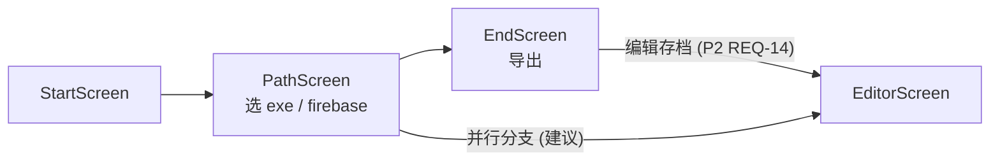

# idleon-saver「存档编辑器」PRD（简单档 / 无竞品分析）

> 产品经理：许清楚（Alice）｜语言：中文｜档位：简单 PRD（默认）

## 0. 项目信息

| 项 | 内容 |
|---|---|
| 项目名 | `idleon-saver` |
| 技术栈 | Python 3.9 + kivy 2.1（GUI）、plyvel（LevelDB）、已有 `stencyl` 编解码模块 |
| 原始需求复述 | 在现有 kivy GUI 中新增「存档编辑器」：将游戏本地 LevelDB 存档解码为带类型标签的 wrapped JSON 供人编辑，编辑后重新编码并写回原目录、替换存档文件。 |
| 档位 | 简单 PRD（默认），不做竞品分析 |

## 假设与约束（已敲定设计决策，直接采纳）

1. **界面形态**：作为新增 `EditorScreen` 集成进现有 kivy GUI，不另起 Web / 独立窗口。
2. **编辑对象**：编辑**带类型标签的 wrapped JSON**（结构 `{"start":..,"contents":..,"end":..}`）。原因：现有 `StencylEncoder` 只接受 wrapped JSON，改完可无损直接回写，最稳。
3. **读档与安全**：
   - 编辑器**自动定位**存档目录 `%APPDATA%\legends-of-idleon\Local Storage\leveldb`；
   - **写回前强制做一份带时间戳的备份**；
   - 检测到游戏进程（`LegendsOfIdleon.exe`）运行时给出警告（避免占用 db 写坏）。

## 1. 产品目标

为 idleon-saver 的高级用户提供一个**内置于现有 GUI 的存档编辑器**：把游戏本地 LevelDB 存档解码成带类型标签的 wrapped JSON，让用户在图形界面里直接修改数值（如 `PlayerDATABASE`、`Cards`、`StampLevel` 等），再无损编码回写原目录。核心价值是**复用仓库已有的 `.ldb → JSON → .ldb` 编解码链路**，在不引入新序列化逻辑的前提下，把"命令行解码/手改/编码回写"的链路收敛为一个安全的 GUI 流程，并用"写前备份 + 进程警告"规避写坏存档的风险。

目标用户：熟悉 Legends of Idleon 存档结构、希望批量/可视化修改本地存档的玩家与工具使用者。该编辑器是一条**相对独立**的流程，直接复用 `decode.py` 的 .ldb 链路，不依赖现有 firebase 向导数据。

## 2. 用户故事

1. 作为一个玩家，我希望打开工具就能自动找到存档目录并加载出来，以便不必手动翻 `%APPDATA%` 路径。
2. 作为一个玩家，我希望在界面里直接编辑带类型标签的 JSON 并保存，以便修改 `PlayerDATABASE` 等数值而不碰命令行的编解码。
3. 作为一个玩家，我希望保存前工具自动备份存档，以便在改坏时能恢复。
4. 作为一个玩家，我希望游戏还在运行时被警告，以免占用 db 导致存档损坏。
5. 作为一个玩家，我希望能查看并还原历史备份，以便在多次修改后回退到某个版本。
6. 作为一个玩家，我希望从现有导出向导的结束页一键进入编辑器，以便导出后顺手微调存档。

## 3. 需求池

### P0（必须做）

| 编号 | 需求 | 验收标准 | 优先级 |
|---|---|---|---|
| REQ-01 | 自动定位存档目录（失败回退手动） | 进入 `EditorScreen` 时尝试探测 `%APPDATA%\legends-of-idleon\Local Storage\leveldb`；成功则自动加载，失败则弹出目录选择对话框让用户手动指定；定位到的路径可用于后续编解码。 | P0 |
| REQ-02 | 加载并展示 wrapped JSON | 复用 `decode.py` 链路（`get_db()` → `StencylDecoder().result` → `write_json` 产出 `decoded_types.json`），将 wrapped JSON 载入编辑区；展示内容与 `decoded_types.json` 结构一致，顶层 key（`PlayerDATABASE`/`Cards`/`CogMap` 等）可识别。 | P0 |
| REQ-03 | 编辑后保存（校验 JSON 合法 + 类型结构完整） | 点击保存时先校验 JSON 语法合法，且保留 `start`/`contents`/`end` 的 wrapped 结构（类型标签不可丢失）；非法 JSON 或结构缺失时**拦截保存**并明确报错。 | P0 |
| REQ-04 | 编码回写 .ldb（带 0x01 前缀） | 保存时将 wrapped JSON 经 `StencylEncoder(data).result` 编码，对每条 key 执行 `db.put(key, b"\x01" + val)` 回写 LevelDB 目录；回写后该目录可被 `decode.py` 再次正常解码，且 `0x01` 前缀正确加回。 | P0 |
| REQ-05 | 写前强制时间戳备份 | 任何写回操作前，复制整个 `leveldb` 目录到备份目录，命名含时间戳（如 `leveldb_20250710_143000`）；每次写回均生成一份新备份，且备份可独立被 `decode.py` 打开。 | P0 |
| REQ-06 | 游戏运行时警告 | 写回前检测 `LegendsOfIdleon.exe` 进程；若运行中，在界面显示警告横幅/弹窗提示风险（不强制阻止，但显著提示）；进程不存在时不出现警告。 | P0 |

### P1（应该做）

| 编号 | 需求 | 验收标准 | 优先级 |
|---|---|---|---|
| REQ-07 | 编辑区实用性（滚动 / 等宽 / 状态） | 编辑 `TextInput` 支持长 JSON 滚动、等宽字体渲染，并在"加载中 / 保存中"显示状态指示。 | P1 |
| REQ-08 | 保存前二次确认 | 点击保存弹出确认对话框，提示"将覆盖原存档且已先备份"；确认后才执行编码回写，取消则中止。 | P1 |
| REQ-09 | 备份管理（列出 / 打开目录） | 提供历史备份清单（按时间戳）与"打开备份目录"入口，点击可在文件管理器中定位备份目录。 | P1 |
| REQ-10 | 简易「还原备份」入口 | 选择某份备份可一键还原（复制回 `leveldb`）；还原前同样强制再备份当前态，还原后 db 可正常读取。 | P1 |

### P2（可选）

| 编号 | 需求 | 验收标准 | 优先级 |
|---|---|---|---|
| REQ-11 | JSON 语法错误高亮 / 定位 | 编辑区对非法 JSON 标红并提示行号/位置。 | P2 |
| REQ-12 | 常用数值快捷修改 | 针对 `PlayerDATABASE` 等常见 key 提供表单化快捷编辑，修改自动同步回 wrapped JSON。 | P2 |
| REQ-13 | 撤销 | 编辑区支持撤销/重做（如 `Ctrl+Z`）。 | P2 |
| REQ-14 | 与导出流程联动 | 在 `EndScreen` 提供「编辑存档」入口，导出完成后可一键进入 `EditorScreen`。 | P2 |

## 4. UI 设计稿

### 4.1 ScreenManager 流转位置



> 说明：`EditorScreen` 作为相对独立流程接入，**直接复用 `decode.py` 的 .ldb 链路**，不依赖 firebase 向导数据。入口建议放在 `EndScreen` 提供「编辑存档」按钮，或作为 `find_exe` 之后的并行分支。

### 4.2 EditorScreen 布局（ASCII 草图）

```
+--------------------------------------------------+
|  标题栏：存档编辑器                        [关闭] |
+--------------------------------------------------+
|  ⚠ 警告横幅（仅游戏运行时显示：检测到游戏进程    |
|     正在运行，写回可能写坏存档，请先关闭游戏）    |
+--------------------------------------------------+
|  载入状态：[空闲]  存档目录：C:\Users\...\leveldb |
+--------------------------------------------------+
|  +--------------------------------------------+   |
|  |  JSON 编辑 TextInput（等宽 / 可滚动）       |   |
|  |  {                                          |   |
|  |    "start": [...],                          |   |
|  |    "contents": { "PlayerDATABASE": ...,     |   |
|  |                  "Cards": ..., ... },        |   |
|  |    "end": [...]                             |   |
|  |  }                                          |   |
|  +--------------------------------------------+   |
+--------------------------------------------------+
|  [保存]   [备份]   [还原备份]   [取消]           |
+--------------------------------------------------+
```

- **标题栏**：固定，提供关闭/返回。
- **警告横幅**：满足条件（REQ-06）时显示，否则隐藏。
- **载入状态行**：显示加载中/保存中状态与当前存档目录（REQ-07）。
- **JSON 编辑 TextInput**：编辑 wrapped JSON，等宽字体、可滚动（REQ-02/07）。
- **按钮行**：保存（REQ-03/04/05/08）、备份（REQ-05/09）、还原备份（REQ-10，P1 可选）、取消。

## 5. 待确认问题（Open Questions）

1. **「还原备份」UI（REQ-10）是否纳入首版**？还是仅提供"打开备份目录"手动还原？
2. **备份保留策略**：保留几份？是否自动清理最旧备份？备份目录路径放在哪里（仓库内 / 存档同级）？
3. **是否允许编辑 unwrapped 视图**：强烈不建议可编辑 unwrapped（易出错），但是否允许**只读对照**展示 `decoded_plain.json` 方便人读？
4. **进程检测粒度**：仅按 exe 名检测，还是结合文件锁/端口？误报与漏报如何权衡？
5. **EditorScreen 入口位置**：放 `EndScreen` 还是 `find_exe` 并行分支？是否影响现有向导默认路径？
6. **大存档展示**：存档很大时，是否在编辑器内按 key 分页/分文件展示，还是单 TextInput 全量？

---

## 交付说明（给主理人）

- **PRD 已就绪**：路径 `docs/prd-editor.md`，简单档，未做竞品分析，结构含 产品目标 / 用户故事 / 需求池(P0-P2) / UI 设计稿 / 待确认问题。
- **关键假设**：① 复用现有 `decode.py`→`StencylDecoder`→`write_json` 与 `encode.py`→`StencylEncoder` 链路，回写必须 `db.put(key, b"\x01"+val)`；② 编辑器只编辑 **wrapped JSON**（`start/contents/end`），禁止编辑 unwrapped 后自行映射；③ 自动定位 `%APPDATA%\legends-of-idleon\Local Storage\leveldb`，代码当前无该探测逻辑需新增（失败回退手动）；④ 写前强制时间戳备份 + 游戏进程运行时警告。
- **进入架构阶段前需确认**：入口位置（EndScreen 还是并行分支）、备份保留策略与目录、是否做「还原备份」UI（REQ-10）、是否允许 unwrapped 只读对照（建议否）。
- **非目标（已写约束）**：不重写编解码逻辑、不提供 unwrapped 编辑、不在游戏运行时强制写回、不做 Web/独立窗口。
